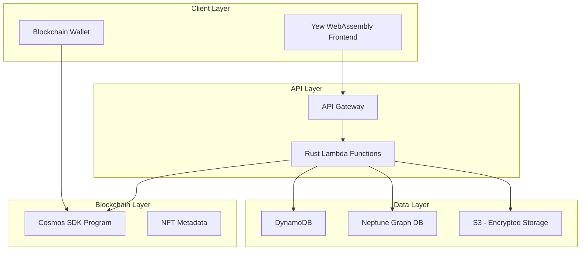

# DegenVets.com AWS Integration
## FedRAMP High Compliant Architecture

## Table of Contents
- [Overview](#overview)
- [Architecture](#architecture)
- [AWS Services](#aws-services)
- [Security and Compliance](#security-and-compliance)
- [Implementation Details](#implementation-details)
- [Deployment](#deployment)
- [Monitoring and Logging](#monitoring-and-logging)

## Overview

The DegenVets.com AWS infrastructure implements a hybrid architecture combining:
- Blockchain-based decentralization
- FedRAMP High compliant AWS services
- Serverless compute with Rust
- WebAssembly frontend
- Decentralized data storage

### Core Design Principles
- Maximum decentralization
- Minimum AWS service dependency
- FedRAMP High compliance
- Cost optimization
- Serverless-first approach

## Architecture



## AWS Services

### Core Services

#### 1. API Gateway
- REST API endpoints
- WebSocket support for real-time updates
- Custom domain and SSL/TLS
- Rate limiting and throttling

```rust
// API Gateway Lambda Integration
use aws_lambda_events::event::apigw::{ApiGatewayProxyRequest, ApiGatewayProxyResponse};
use lambda_runtime::{run, service_fn, Error, LambdaEvent};

async fn handler(event: LambdaEvent<ApiGatewayProxyRequest>) -> Result<ApiGatewayProxyResponse, Error> {
    // Request handling logic
}
```

#### 2. Lambda Functions
- Rust-based implementations
- Custom runtime optimization
- WebAssembly compilation support
- Minimal cold starts

```rust
// Lambda Function Example
use aws_config::meta::region::RegionProviderChain;
use aws_sdk_dynamodb::Client;
use lambda_runtime::{service_fn, LambdaEvent, Error};
use serde_json::{json, Value};

#[tokio::main]
async fn main() -> Result<(), Error> {
    let func = service_fn(handler);
    lambda_runtime::run(func).await?;
    Ok(())
}

async fn handler(event: LambdaEvent<Value>) -> Result<Value, Error> {
    let region_provider = RegionProviderChain::default_provider().or_else("us-east-1");
    let config = aws_config::from_env().region(region_provider).load().await;
    let client = Client::new(&config);
    
    // Handler implementation
    Ok(json!({"status": "success"}))
}
```

#### 3. DynamoDB
- Decentralized data consistency
- ACID transactions
- Time-to-live (TTL) for temporary data
- Global tables for redundancy

```rust
// DynamoDB Integration
use aws_sdk_dynamodb::model::AttributeValue;
use aws_sdk_dynamodb::{Client, Error};

async fn query_farm_shares(
    client: &Client,
    producer_id: &str,
) -> Result<Vec<FarmShare>, Error> {
    let result = client
        .query()
        .table_name("FarmShares")
        .key_condition_expression("ProducerId = :pid")
        .expression_attribute_values(":pid", AttributeValue::S(producer_id.to_string()))
        .send()
        .await?;
        
    // Process results
}
```

#### 4. Neptune Graph DB
- Compliance relationship tracking
- Farm share ownership graphs
- Producer-consumer relationships
- Geographic distribution analysis

```rust
// Neptune Graph Query
use aws_sdk_neptunedata::{Client, Region};
use gremlin_client::{GremlinClient, Vertex};

async fn get_producer_network(
    client: &GremlinClient,
    producer_id: &str,
) -> Result<Vec<Vertex>, Box<dyn std::error::Error>> {
    let query = client
        .execute("g.V().hasLabel('producer')")
        .await?;
        
    // Process results
}
```

### Supporting Services

#### 1. S3
- Encrypted document storage
- Static WebAssembly hosting
- Compliance documentation
- Access logs

```rust
// S3 Integration
use aws_sdk_s3::Client;
use aws_sdk_s3::types::ByteStream;

async fn upload_compliance_doc(
    client: &Client,
    bucket: &str,
    key: &str,
    data: ByteStream,
) -> Result<(), Box<dyn std::error::Error>> {
    client
        .put_object()
        .bucket(bucket)
        .key(key)
        .body(data)
        .send()
        .await?;
    Ok(())
}
```

#### 2. CloudWatch
- Lambda function monitoring
- API Gateway logs
- Custom metrics
- Compliance auditing

```rust
// CloudWatch Metrics
use aws_sdk_cloudwatch::Client;
use aws_sdk_cloudwatch::model::{Dimension, MetricDatum, StandardUnit};

async fn log_transaction_metric(
    client: &Client,
    producer_id: &str,
    amount: f64,
) -> Result<(), Box<dyn std::error::Error>> {
    let dimension = Dimension::builder()
        .name("ProducerId")
        .value(producer_id)
        .build();

    let datum = MetricDatum::builder()
        .metric_name("TransactionAmount")
        .unit(StandardUnit::None)
        .value(amount)
        .dimensions(dimension)
        .build();

    client
        .put_metric_data()
        .namespace("degen/Transactions")
        .metric_data(datum)
        .send()
        .await?;
    Ok(())
}
```

## Security and Compliance

### FedRAMP High Controls

#### 1. Data Encryption
- At-rest encryption using AWS KMS
- In-transit encryption using TLS 1.3
- Customer-managed keys
- Blockchain-based verification

```rust
// KMS Integration
use aws_sdk_kms::Client;

async fn encrypt_sensitive_data(
    client: &Client,
    key_id: &str,
    data: &[u8],
) -> Result<Vec<u8>, Box<dyn std::error::Error>> {
    let response = client
        .encrypt()
        .key_id(key_id)
        .plaintext(data.into())
        .send()
        .await?;
    
    Ok(response.ciphertext_blob.unwrap().into_inner())
}
```

#### 2. Access Control
- IAM roles and policies
- NFT-based authorization
- Principle of least privilege
- Regular access reviews

#### 3. Audit Logging
- CloudWatch Logs
- CloudTrail
- S3 access logs
- Custom compliance logs

### Blockchain Integration

#### 1. NFT Authorization
- Token-gated access
- Attribute-based control
- Cross-chain verification
- Real-time validation

## Implementation Details

### Yew Frontend Integration

```rust
use yew::prelude::*;
use wasm_bindgen::JsValue;

#[function_component(ProducerDashboard)]
pub fn producer_dashboard() -> Html {
    let producer_data = use_state(|| None);
    
    use_effect_with_deps(|_| {
        let data = producer_data.clone();
        wasm_bindgen_futures::spawn_local(async move {
            let response = fetch_producer_data().await;
            data.set(Some(response));
        });
        || ()
    }, ());
    
    html! {
        // Dashboard implementation
    }
}
```

### Lambda Handler Implementation

```rust
use lambda_runtime::{service_fn, LambdaEvent, Error};
use serde_json::{json, Value};

#[tokio::main]
async fn main() -> Result<(), Error> {
    let func = service_fn(handler);
    lambda_runtime::run(func).await?;
    Ok(())
}

async fn handler(event: LambdaEvent<Value>) -> Result<Value, Error> {
    // Handler implementation
    Ok(json!({"status": "success"}))
}
```

## Deployment

### Infrastructure as Code

```rust
use aws_cdk_lib::aws_lambda;
use aws_cdk_lib::aws_apigateway as apigw;

fn create_api_stack(app: &mut App) {
    let stack = Stack::new(app, "DegenApiStack");
    
    let handler = aws_lambda::Function::Builder::default()
        .runtime(aws_lambda::Runtime::PROVIDED_AL2)
        .handler("bootstrap")
        .code(aws_lambda::Code::from_asset("./target/lambda"))
        .build(&stack);
        
    let api = apigw::RestApi::Builder::default()
        .rest_api_name("DegenApi")
        .build(&stack);
        
    api.root
        .add_resource("producers")
        .add_method("GET", apigw::Integration::lambda(handler));
}
```

## Monitoring and Logging

### Custom Metrics

```rust
use aws_sdk_cloudwatch::Client;

async fn monitor_transactions(
    client: &Client,
    metrics: Vec<TransactionMetric>,
) -> Result<(), Error> {
    for metric in metrics {
        client
            .put_metric_data()
            .namespace("Degen/Transactions")
            .metric_data(metric.into())
            .send()
            .await?;
    }
    Ok(())
}
```

### Log Analysis

```rust
use aws_sdk_cloudwatchlogs::Client;

async fn analyze_compliance_logs(
    client: &Client,
    log_group: &str,
    start_time: i64,
    end_time: i64,
) -> Result<Vec<ComplianceEvent>, Error> {
    let response = client
        .filter_log_events()
        .log_group_name(log_group)
        .start_time(start_time)
        .end_time(end_time)
        .send()
        .await?;
        
    // Process and analyze logs
    Ok(Vec::new())
}
```